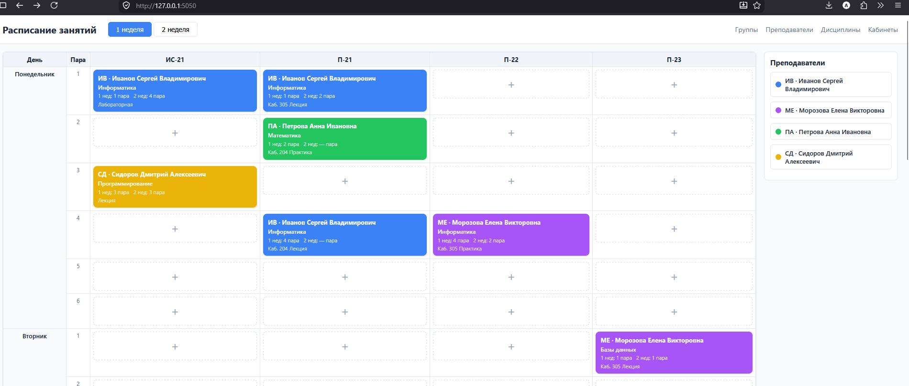
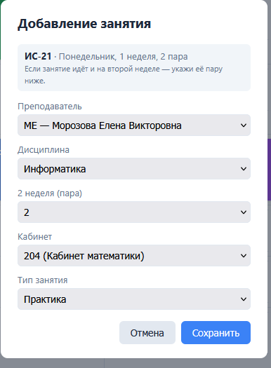
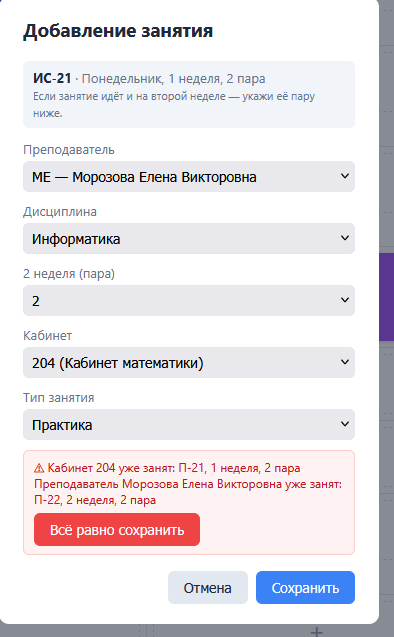
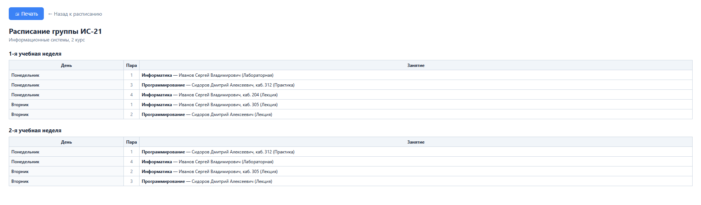
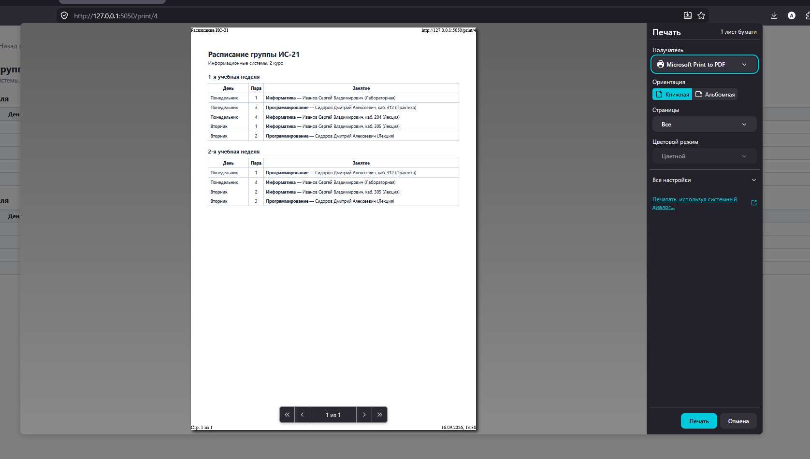

# Веб-приложение для формирования расписания

Учебная практика УП01.05. Электронная доска расписания: группы по горизонтали,
дни недели и учебные пары по вертикали, крупные карточки занятий с поддержкой
двух учебных недель.

## Стек

- **Backend:** Flask, Flask-SQLAlchemy
- **База данных:** MySQL
- **Frontend:** HTML/CSS/JavaScript (без фреймворков)

## Структура проекта

```
schedule_app/
├── app.py                 # точка входа, фабрика приложения
├── config.py               # чтение .env, строка подключения к БД
├── extensions.py            # экземпляр SQLAlchemy
├── models/                  # ORM-модели (Group, Teacher, Subject, Classroom, Lesson)
├── routes/                  # REST API (по одному файлу на сущность)
├── static/
│   ├── css/style.css
│   └── js/                  # api.js — обёртка над fetch, schedule.js — логика экрана
├── templates/
│   └── index.html            # главный экран
├── schema.sql                 # SQL-схема + тестовые данные
├── requirements.txt
└── .env.example                # шаблон переменных окружения
```

## Установка и запуск

1. Создать базу данных: выполнить `schema.sql` в MySQL (Workbench или консоль).
2. Создать виртуальное окружение и установить зависимости:
   ```
   python -m venv venv
   venv\Scripts\activate
   pip install -r requirements.txt
   ```
3. Скопировать `.env.example` в `.env` и указать пароль от MySQL.
4. Запустить сервер:
   ```
   python app.py
   ```
5. Открыть `http://127.0.0.1:5050/`.

## Модель данных

- `groups` — учебные группы (название, специальность, курс)
- `teachers` — преподаватели (ФИО, краткое обозначение, цвет карточки)
- `subjects` — дисциплины
- `teacher_subjects` — связь «преподаватель ↔ несколько дисциплин» (many-to-many)
- `classrooms` — кабинеты (дополнительный раздел)
- `lessons` — занятия; поля `week1_lesson` и `week2_lesson` хранят номер пары
  на 1-й и 2-й неделе в одной карточке

## Реализованный функционал

- [x] Справочники групп, преподавателей, дисциплин, кабинетов (CRUD через интерфейс и REST API)
- [x] Связь преподаватель → несколько дисциплин
- [x] Главный экран: таблица расписания, крупные карточки занятий
- [x] Отображение 1-й и 2-й учебной недели (переключатель + обе недели на карточке)
- [x] Добавление / редактирование / удаление занятий
- [x] Проверка конфликтов (преподаватель, группа, кабинет)
- [x] Drag & Drop (перетаскивание дисциплины из панели, перемещение карточек между ячейками)
- [x] Индивидуальное задание №21 (печать расписания группы)

## Индивидуальное задание

№21 — печать расписания выбранной группы на отдельной странице.

## Скриншоты

Главный экран:



Форма добавления занятия:



Проверка конфликтов:



Печать расписания группы:



Печать расписания группы доп:



Справочник преподавателей:


